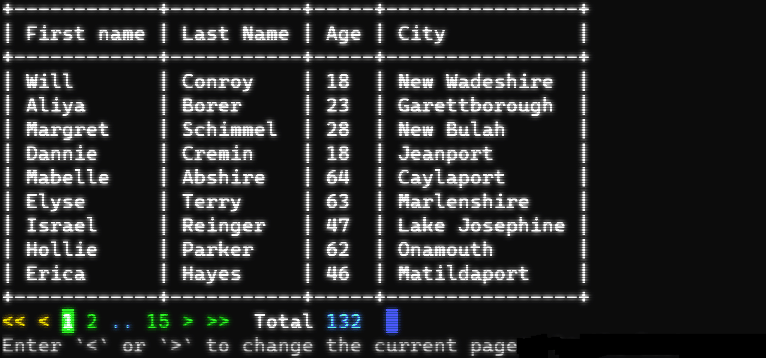
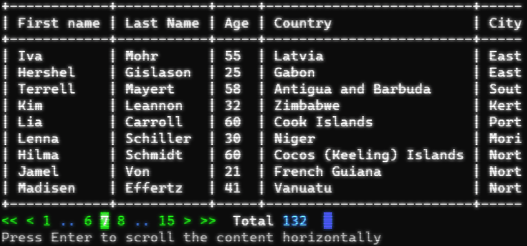

<p align="center">

</p>

<p align="center">
<a href="https://packagist.org/packages/clitube/clitube"></a>
<a href="https://packagist.org/packages/clitube/clitube"></a>
<a href="https://packagist.org/packages/clitube/clitube"></a>
<a href="https://github.com/clitube/clitube/actions"></a>
<a href="https://shepherd.dev/github/clitube/clitube"></a>
<a href="https://shepherd.dev/github/clitube/clitube"></a>
</p>

The package will help you to render paginated tables and any plain text content in a console.

## Requirements

Make sure that your server is configured with following PHP version and extensions:

- PHP 8.1+

## Installation

You can install the package via composer:

```bash
composer require clitube/clitube
```

## Examples

### Paginator Component

```php
$core = (new \CliTube\Core($output))
$core->createComponent(\CliTube\Component\Paginator::class, [
    new MyPaginator(), // Instanceof \CliTube\Data\Paginator
])
$core->run();
```

#### Navigation



#### A wide table scrolling



### Scroll Component

```php
$core = (new \CliTube\Core($output))
$core->createComponent(\CliTube\Component\Scroll::class, [
    'content' => 'Very long text',
    'overwrite' => true,
])
$core->run();
```

## Testing

```bash
composer test
```

## License

The MIT License (MIT). Please see [License File](LICENSE) for more information.
